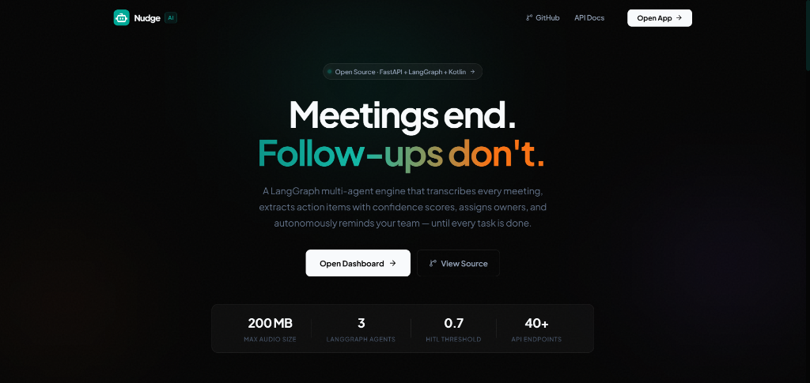
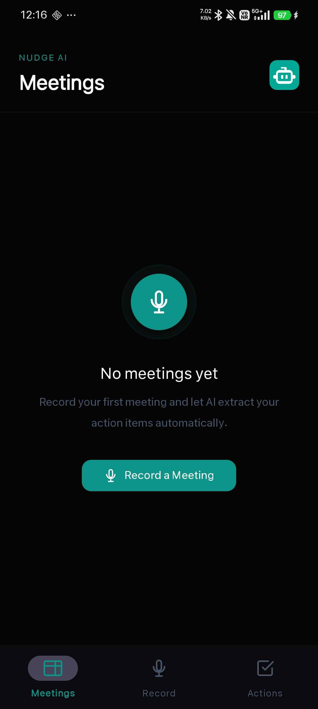
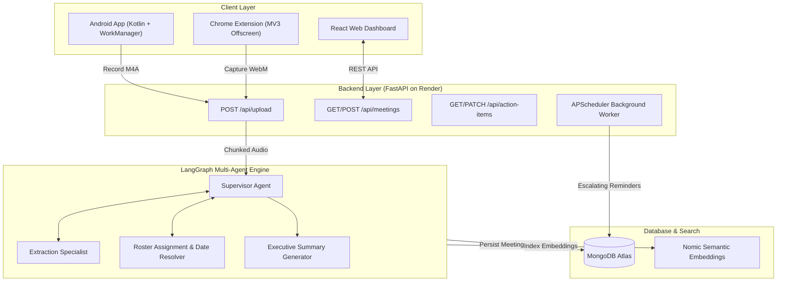

<div align="center">
  
  <h1>Nudge AI</h1>
  <p><b>Autonomous Meeting Intelligence & Personal Task Follow-Up System</b></p>
  <p>Captures meeting audio, extracts key decisions and personal action items with LangGraph, assigns owners, and delivers automated deadline reminders and follow-up loops.</p>
  <br/>

  <a href="https://nudge-three-coral.vercel.app/">
    
  </a>
  &nbsp;
  <a href="https://nudge-backend-8fri.onrender.com/docs">
    
  </a>
  <br/><br/>

  
  
  
  
  
  
  <br/><br/>
  <a href="https://nudge-three-coral.vercel.app/">
    
  </a>
</div>

---

## Mobile Application

| Meetings List | Audio Recording | Action Items | Empty State |
|:---:|:---:|:---:|:---:|
|  |  |  |  |

---

## Overview

Meetings produce critical decisions and commitments, but after calls conclude, action items frequently become buried in transcripts and forgotten without manual follow-up.

Nudge AI addresses this through **personal task accountability** and **automated follow-through**:

1. **Personal Task Focus:** Action items assigned to the user are automatically flagged (`is_mine=True`), allowing instant visibility into individual deliverables without navigating full meeting transcripts.
2. **Local and Push Notifications:** Android WorkManager monitors approaching deadlines and issues proactive notifications 24 hours and 2 hours in advance.
3. **Escalating Follow-Up Loop:** Uncompleted tasks trigger structured follow-up sequences (gentle $\rightarrow$ firm $\rightarrow$ urgent) via email and Slack until marked complete.
4. **Human-in-the-Loop (HITL):** Extractions with confidence $< 0.7$ are flagged for one-tap approval before automated reminders are scheduled.

---

## System Architecture



---

## Core Capabilities

- **Multi-Platform Audio Ingestion:** Capture audio natively via Android (`MediaRecorder`), upload files on the web dashboard (up to 200MB chunked), or record live tab audio using the Chrome Extension.
- **High-Throughput Transcription:** Leverages Groq Whisper Large v3 with automated 20MB chunking for rapid speech-to-text processing.
- **Structured Multi-Agent Extraction:** LangGraph orchestrates specialized extraction agents with Pydantic schemas to output decisions, assignees, and confidence scores.
- **Natural Language Date Normalization:** Converts relative meeting phrasing (*"by next Tuesday afternoon"*, *"by Friday morning"*) into normalized ISO timestamps.
- **Automated Escalation Workflows:** Scheduled background jobs dispatch escalating reminder notifications via email and Slack when deadlines approach.
- **Fault-Tolerant Infrastructure:** Built-in exponential backoff for Groq rate limits, SHA-256 audio file deduplication, and automated Render keepalive monitoring.

---

## Tech Stack

| Layer | Technologies |
|---|---|
| **Mobile (Android)** | Kotlin, Material3, View Binding, Retrofit2, Coroutines, AndroidX WorkManager, Notifications API |
| **Backend** | Python 3.11, FastAPI, LangGraph, LangChain, Pydantic v2, APScheduler, PyMongo |
| **AI / ML** | Groq (`llama-3.3-70b-versatile`, `whisper-large-v3-turbo`), Nomic Embeddings |
| **Frontend** | React 18, Vite, React Router v7, Lucide Icons, React Hot Toast |
| **Database** | MongoDB Atlas M0 (Optimized document schema, metadata-only storage) |
| **Infrastructure** | Render (API), Vercel (Web Dashboard), GitHub Actions (Keepalive Monitoring) |

---

## Getting Started

### 1. Backend Setup (FastAPI)
```bash
# Clone repository
git clone https://github.com/Kishan8548/Nudge.git
cd Nudge

# Create and activate virtual environment
python -m venv venv
source venv/bin/activate  # On Windows: venv\Scripts\activate

# Install dependencies
pip install -r requirements.txt

# Configure environment variables
cp .env.example .env
# Set GROQ_API_KEY and MONGODB_URI in .env

# Start development server
uvicorn backend.main:app --reload --port 8000
```

### 2. Frontend Setup (React + Vite)
```bash
cd frontend
npm install
npm run dev
```

### 3. Android Application Setup
1. Open the `android/` directory in **Android Studio**.
2. Sync Gradle dependencies (`build.gradle.kts`).
3. Verify the backend base URL in `RetrofitClient.kt` (configured for production Render by default).
4. Deploy to an Android device or emulator running API 26 or higher.

---

## API Endpoints

| Method | Endpoint | Description |
|---|---|---|
| `POST` | `/api/upload` | Upload audio file (`.m4a`, `.mp3`, `.webm`) and trigger transcription |
| `GET` | `/api/meetings` | Retrieve paginated list of meetings with summaries and durations |
| `GET` | `/api/meetings/{id}` | Retrieve complete meeting details, transcript, and action items |
| `POST` | `/api/meetings/{id}/process` | Execute LangGraph extraction and assignment pipeline |
| `DELETE` | `/api/meetings/{id}` | Cascade delete meeting, associated action items, and embeddings |
| `GET` | `/api/action-items?mine=true` | Query action items filtered by assignee status |
| `PATCH` | `/api/action-items/{id}` | Update task status (`pending`, `in_progress`, `done`) |
| `POST` | `/api/action-items/{id}/remind` | Dispatch on-demand email reminder |
| `GET` | `/api/health` | Service health check and keepalive probe |

---

## License

This project is licensed under the MIT License.
