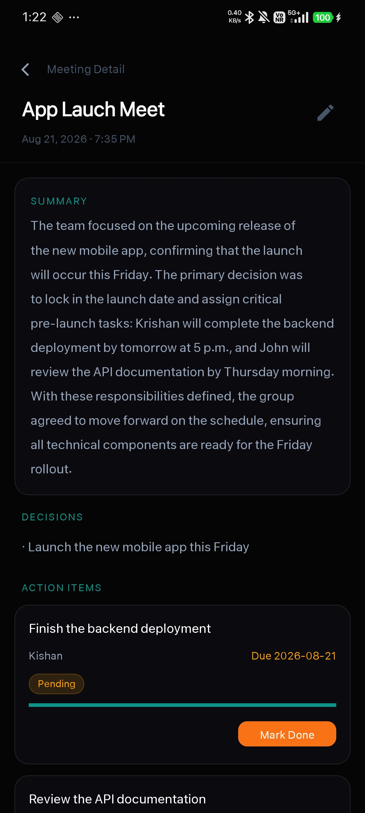
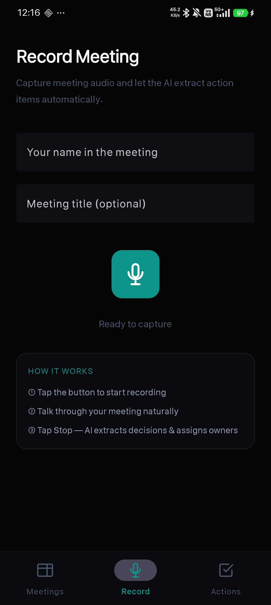
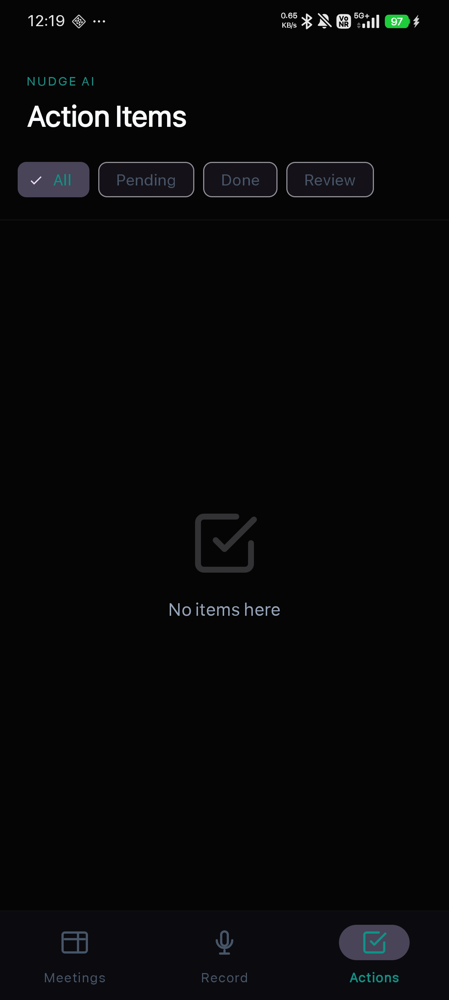

<div align="center">
  
  <h1>Nudge AI</h1>
  <p><b>Autonomous Meeting Intelligence & Personal Task Follow-Up System</b></p>
  <p>Captures live audio from meetings, extracts decisions & personal action items with LangGraph, assigns owners, and delivers smart deadline alerts & automated escalating follow-ups.</p>
  <br/>

  <a href="https://nudge-three-coral.vercel.app/">
    
  </a>
  &nbsp;
  <a href="https://nudge-backend-8fri.onrender.com/docs">
    
  </a>
  <br/><br/>

  
  
  
  
  
  
</div>

---

## 📱 Screenshots

> Paste your screenshots into the [`screenshots/`](./screenshots) directory (`home.png`, `detail.png`, `record.png`, `action_items.png`, `dashboard.png`) to showcase them here.

| Android Home Screen | Meeting Detail & Summary | Audio Recording Screen |
|:---:|:---:|:---:|
|  |  |  |

| Action Items & Deadlines | Web Dashboard Overview |
|:---:|:---:|
|  |  |

---

## 💡 What is Nudge AI?

Meetings produce critical decisions and commitments, but after the call ends, tasks get buried in transcripts and forgotten. 

**Nudge AI** solves this by focusing on **your personal action items** and **automated accountability**:
1. **Focus on *Your* Tasks:** Automatically tags tasks assigned to you (`is_mine=True`) so you immediately see what you owe without sifting through everyone else's notes.
2. **Local & Push Notifications:** Android WorkManager monitors approaching deadlines and alerts you 24h/2h in advance.
3. **Escalating Follow-Up Loop:** Uncompleted action items trigger gentle $\rightarrow$ firm $\rightarrow$ urgent emails to owners and Slack alerts until marked done.
4. **Human-in-the-Loop (HITL):** Extractions with confidence $< 0.7$ are flagged for one-tap approval before reminders fire.

---

## 🏗️ Architecture & Multi-Agent Flow


---

## 🌟 Core Features

- 🎙️ **Multi-Platform Audio Capture:** Record natively on Android (`MediaRecorder`), upload files on Web (up to 200MB chunked), or capture live tab audio via Chrome Extension.
- ⚡ **Lightning Fast Speech-to-Text:** Transcribes audio via Groq Whisper Large v3 with automatic 20MB chunking.
- 🤖 **LangGraph Reasoning Pipeline:** Pydantic-structured outputs extract key decisions, assignees, and deadlines with confidence scores.
- 📅 **Smart Date Resolution:** Translates natural language dates (*"by next Tuesday at 4pm"*, *"by Friday morning"*) into exact ISO timestamps.
- 🔔 **Autonomous Follow-Ups:** Periodic email reminders escalate from gentle reminders to urgent manager notifications after repeated missed deadlines.
- 🛡️ **Production Reliability:** Exponential backoff retry on Groq rate limits, SHA-256 duplicate meeting detection, and 24/7 Render keepalive automation.

---

## 🛠️ Tech Stack

| Layer | Technologies |
|---|---|
| **Android** | Kotlin, Material3, View Binding, Retrofit2, Coroutines, AndroidX WorkManager, Notifications API |
| **Backend** | Python 3.11, FastAPI, LangGraph, LangChain, Pydantic v2, APScheduler, PyMongo |
| **AI Models** | Groq (`llama-3.3-70b-versatile`, `whisper-large-v3-turbo`), Nomic Embeddings |
| **Frontend** | React 18, Vite, React Router v7, Lucide Icons, React Hot Toast |
| **Database** | MongoDB Atlas M0 (Optimized schema, no binary audio in DB) |
| **Deployment** | Render (Backend), Vercel (Web Dashboard), GitHub Actions (Keepalive Cron) |

---

## ⚡ Quick Start

### 1. Backend (FastAPI)
```bash
# Clone repository
git clone https://github.com/Kishan8548/Nudge.git
cd Nudge

# Create and activate virtual environment
python -m venv venv
source venv/bin/activate  # On Windows: venv\Scripts\activate

# Install dependencies
pip install -r requirements.txt

# Configure environment variables
cp .env.example .env
# Edit .env with your GROQ_API_KEY and MONGODB_URI

# Run development server
uvicorn backend.main:app --reload --port 8000
```

### 2. Frontend (React + Vite)
```bash
cd frontend
npm install
npm run dev
```

### 3. Android App
1. Open the [`android/`](./android) folder in **Android Studio**.
2. Sync Gradle files (`build.gradle.kts`).
3. Set your backend URL in `RetrofitClient.kt` (defaults to production Render backend).
4. Run on an Android device or emulator with API 26+.

---

## 📡 API Reference

| Method | Endpoint | Description |
|---|---|---|
| `POST` | `/api/upload` | Upload audio file (`.m4a`, `.mp3`, `.webm`) & transcribe |
| `GET` | `/api/meetings` | List all meetings with decisions and durations |
| `GET` | `/api/meetings/{id}` | Get full meeting detail, transcript, and action items |
| `POST` | `/api/meetings/{id}/process` | Run LangGraph multi-agent extraction pipeline |
| `DELETE` | `/api/meetings/{id}` | Cascade delete meeting, action items, and embeddings |
| `GET` | `/api/action-items?mine=true` | List pending action items filtered by assignee |
| `PATCH` | `/api/action-items/{id}` | Update status (`pending`, `in_progress`, `done`) |
| `POST` | `/api/action-items/{id}/remind` | Trigger on-demand email reminder |
| `GET` | `/api/health` | Service health & keepalive ping |

---

## 📄 License

MIT License. Built for the Hackathon Demo.
