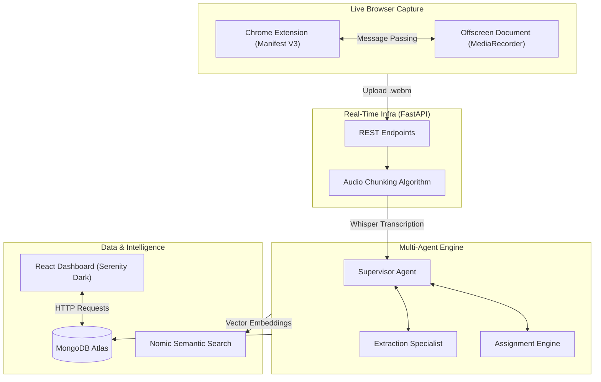
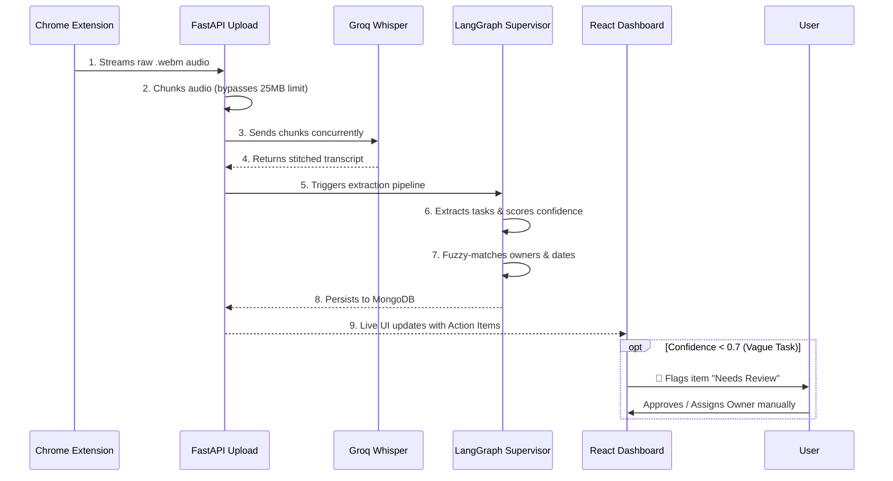

<div align="center">
  
  
  <br/><br/>
  <h1>🧠 Nudge AI</h1>
  <p><b>Problem Statement 2: AI Meeting & Follow-Up Agent</b></p>
  <p>A multi-agent system that lives in your browser, transcribes meetings on the fly, extracts decisions, and autonomously sends reminders until every action item is marked complete.</p>
</div>

---

## 📖 Overview

**Nudge AI** is a next-generation meeting observability and accountability platform.

Meetings generate decisions and action items constantly, but the moment the call ends, most of it goes untracked — no one is quite sure who owes what, by when, and follow-ups rarely happen unless someone manually chases them.

**Nudge AI** solves this exact problem by introducing a **Multi-Agent Reasoning Engine**. 

We built a custom Chrome Extension that captures tab audio live from Google Meet, Zoom, or any browser tab. When the meeting ends, it uploads the audio via a custom chunking algorithm to our FastAPI backend. There, our LangGraph multi-agent system transcribes the audio, extracts business decisions, assigns tasks to team members by fuzzy-matching names to a roster, resolves relative dates (e.g., "by next Friday") into precise ISO deadlines, and tracks them on a stunning Serenity Dark dashboard. If it's unsure about a task, it flags it for human review.

---

## 🏆 Addressing the Problem Statement

We directly tackled the exact requirements of **Problem Statement 2** by building a complete end-to-end pipeline:

- ✅ **Transcript/action-item extraction:** Custom Chrome Extension captures audio live, chunks it, and uses Whisper + LangGraph to meticulously extract tasks and decisions.
- ✅ **Owner and deadline assignment:** The Assignment Agent fuzzy-matches spoken names to internal team rosters and resolves casual deadlines ("by next Friday") into strict ISO dates.
- ✅ **Automated reminder/follow-up loop:** An APScheduler chron job runs continuously on the FastAPI backend, utilizing Gmail SMTP to autonomously nag assignees with escalating urgency until the task is marked done.
- ✅ **Simple dashboard of pending vs. completed items:** A stunning "Serenity Dark" React dashboard providing a command center view of all meetings, pending items, and completed tasks.

### Hitting the Judging Criteria
- **Innovation & Technical Depth**: Moving beyond simple LLM wrappers, we built a deterministic multi-agent workflow using LangGraph, complete with a custom audio-chunking algorithm to bypass the 25MB API limit for massive 200MB meeting files.
- **Engineering Quality**: A robust Python/FastAPI backend paired with a seamless Manifest V3 Chrome Extension that uses Offscreen Documents to bypass service worker suspension limits.
- **Design & User Experience**: Our React frontend uses a meticulously crafted glassmorphism aesthetic. It acts as a high-stakes command center, transforming raw JSON traces into an intuitive, visually stunning experience.
- **Execution Quality & Completeness**: From the Chrome Extension capturing live audio, to the fully functional multi-agent engine, automated email loop, RAG semantic search, and interactive web app, the project is a complete product built in 24 hours.

---

## 🏗️ System Architecture

The Nudge ecosystem is built on four core pillars, designed for extreme concurrency, precise extraction, and AI-driven accountability.



### 1. Live Browser Capture (Extension)
At the core of the ingestion pipeline is a Manifest V3 Chrome Extension. Because background service workers fall asleep after 30 seconds, we route the live audio feed from `chrome.tabCapture` into a persistent **Offscreen Document**. This guarantees infinite, uninterrupted recording of any web meeting.

### 2. Real-Time Infrastructure (FastAPI)
The backend is wrapped in a high-performance **FastAPI server**. To handle massive meeting files that exceed the Groq Whisper API 25MB limit, we built a custom audio chunking algorithm using `pydub` that splits 200MB+ files into precise, overlapping segments without cutting words in half.

### 3. Multi-Agent Reasoning Engine (LangGraph)
Once transcribed, the text hits our LangGraph supervisor. 
- The **Extraction Specialist** analyzes the text for decisions and tasks, rating its own confidence (0.0 - 1.0).
- The **Assignment Engine** uses fuzzy-matching to map spoken names to internal rosters and resolves relative NLP deadlines ("tomorrow evening") into strict ISO calendar dates.

### 4. Interactive Dashboard (React)
A dynamic React application built with a premium "Serenity Dark" glassmorphism aesthetic. It visualizes meeting data, manages RAG semantic searches, and provides the Human-in-the-Loop interface for reviewing low-confidence AI assumptions.

---

## 🔍 The Extraction Flow (How it Works)

When a meeting concludes, Nudge doesn't just save a text file—it deeply analyzes the conversation to enforce accountability.



---

## 🚀 Getting Started

To run the Nudge AI backend, frontend, and extension locally:

### 1. Configure Environment
```bash
git clone <repo-url>
cd Nudge

# Copy the template and add your API keys (Groq, MongoDB, etc.)
cp .env.example .env
```

### 2. Start the Backend (FastAPI + LangGraph)
```bash
# Create and activate virtual environment
python -m venv .venv
.venv\Scripts\activate        # Windows
# source .venv/bin/activate   # macOS/Linux

# Install dependencies and run
pip install -r requirements.txt
uvicorn backend.main:app --reload --host 0.0.0.0 --port 8000
```

### 3. Start the Frontend (React + Vite)
```bash
cd frontend
npm install
npm run dev
```
The frontend will start on `http://localhost:5173`. You will be greeted by the cinematic dashboard.

### 4. Install the Chrome Extension
1. Open Chrome and navigate to `chrome://extensions/`.
2. Enable **Developer mode** in the top right.
3. Click **Load unpacked** and select the `Nudge/extension/` folder.
4. Click the extension icon and hit **Start Capture**!

---


---
<div align="center">
  <i>Built to kill meeting amnesia, forever.</i>
</div>
