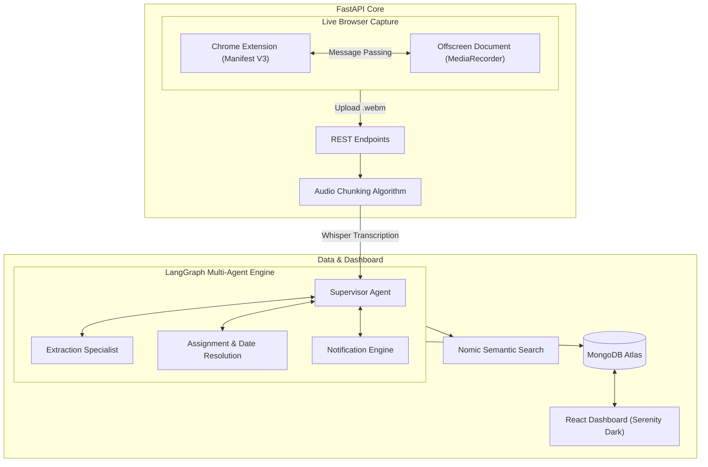

<div align="center">
  
  <br/><br/>
  <h1>🧠 Nudge AI</h1>
  <p><b>The Zero-Click Meeting Agent & Accountability Engine</b></p>
  <p>A multi-agent system that lives in your browser, transcribes meetings on the fly, extracts decisions, and relentlessly chases down action items so you never have to.</p>
</div>

---

## 📖 Overview

**Nudge AI** is a next-generation meeting observability and accountability platform.

Meetings are a black hole for productivity. Decisions are forgotten, tasks are lost in the noise, and following up on action items wastes millions of hours every year. Nudge AI solves this by introducing a **Multi-Agent Reasoning Engine**. 

We built a custom Chrome Extension that captures tab audio live from Google Meet, Zoom, or any browser tab. When the meeting ends, it uploads the audio via a custom chunking algorithm to our FastAPI backend. There, our LangGraph multi-agent system transcribes the audio, extracts business decisions, assigns tasks to team members by fuzzy-matching names to a roster, resolves relative dates (e.g., "by next Friday") into precise ISO deadlines, and tracks them on a stunning Serenity Dark dashboard. If it's unsure about a task, it flags it for human review.

---

## 🏆 Hackathon Highlights & Technical Depth

**Themes Targeted:**
- 🤖 **Agentic & Autonomous Systems**: Nudge features an ecosystem of AI agents (Extraction, Assignment, Reminder, Supervisor) that think, negotiate, and act independently.
- ⚡ **Workflow Automation**: We transform human workflows by predicting deadlines, automating follow-up emails, and organizing RAG-based meeting searches.

### Addressing the Judging Criteria
- **Innovation & Technical Depth**: Moving beyond simple LLM wrappers, we built a deterministic multi-agent workflow using LangGraph, complete with a custom audio-chunking algorithm to bypass the 25MB API limit for massive 200MB meeting files.
- **Engineering Quality**: A robust Python/FastAPI backend paired with a seamless Manifest V3 Chrome Extension that uses Offscreen Documents to bypass service worker suspension limits.
- **Design & User Experience**: Our React frontend uses a meticulously crafted "Serenity Dark" glassmorphism aesthetic. It acts as a high-stakes command center, transforming raw JSON traces into an intuitive, visually stunning experience.
- **Execution Quality & Completeness**: From the Chrome Extension capturing live audio, to the fully functional multi-agent engine, RAG semantic search, and the interactive web app, the project is a complete, end-to-end product built in 24 hours.

---

## 🏗️ System Architecture

The Nudge ecosystem is built on four core pillars, designed for extreme concurrency, precise extraction, and AI-driven accountability.



---

## ✨ Key Features

1. **Live Browser Capture**: A custom Chrome extension that records tab audio directly from your browser, bypassing the need for complex bot integrations.
2. **Infinite Audio Chunking**: A custom algorithm that splits large meeting files, allowing you to bypass the standard 25MB Whisper API limit and upload up to 200MB.
3. **Multi-Agent Extraction**: Uses LangGraph to meticulously extract decisions, action items, and confidence scores.
4. **Fuzzy Roster Matching**: The AI automatically links mentioned names ("Suren") to actual employee profiles and emails.
5. **Relative Deadline Resolution**: Converts casual conversational deadlines ("let's do it tomorrow") into strict calendar dates.
6. **Human-in-the-Loop (HITL)**: Ambiguous tasks with low confidence scores (< 0.7) are automatically flagged in orange on the dashboard for a human to Approve or Reject.
7. **Semantic RAG Search**: Instantly find past meetings and decisions based on meaning and context, not just keyword matching.

---

## 🚀 Quick Start (Running Locally)

### 1. Prerequisites
- **Python 3.11+** and **Node.js 18+**
- Free accounts on:
  - [Groq Cloud](https://console.groq.com)
  - [MongoDB Atlas](https://cloud.mongodb.com)

### 2. Configure Environment
```bash
git clone <repo-url>
cd Nudge

# Copy the template and add your API keys
cp .env.example .env
```

### 3. Run the Backend
```bash
# Create and activate virtual environment
python -m venv .venv
.venv\Scripts\activate        # Windows
# source .venv/bin/activate   # macOS/Linux

# Install dependencies and run
pip install -r requirements.txt
uvicorn backend.main:app --reload --host 0.0.0.0 --port 8000
```

### 4. Run the Frontend (New Terminal)
```bash
cd frontend
npm install
npm run dev
```
*(The dashboard will be available at `http://localhost:5173`)*

### 5. Install the Chrome Extension
1. Open Chrome and navigate to `chrome://extensions/`.
2. Enable **Developer mode** in the top right.
3. Click **Load unpacked** and select the `Nudge/extension/` folder.
4. Open the extension, enter your meeting title, and start capturing!
