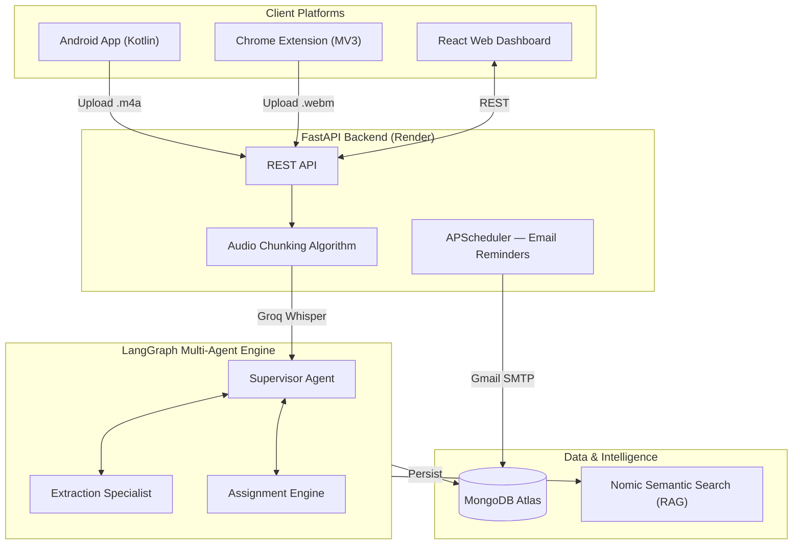

<div align="center">
  <h1>Nudge AI</h1>
  <p><b>AI Meeting Follow-Up Agent · Full-Stack + Android</b></p>
  <p>A multi-platform system that captures meeting audio, extracts action items with a multi-agent AI pipeline, assigns owners, and autonomously follows up until every task is done.</p>
  <br/>
  <a href="https://nudge-three-coral.vercel.app/">
    
  </a>
  &nbsp;
  
  
  
  
</div>

---

## What is Nudge AI?

Meetings generate decisions and action items constantly, but the moment a call ends, most of it goes untracked — no one is sure who owes what or by when, and follow-ups rarely happen without manual chasing.

**Nudge AI** solves this with a **Multi-Agent Reasoning Engine** that captures your meeting, understands it, and keeps everyone accountable — automatically.

---

## Platform Overview

| Platform | Technology | Purpose |
|---|---|---|
| **Android App** | Kotlin + XML + Retrofit | Native mobile — record meetings, review action items, approve/reject AI decisions |
| **Web Dashboard** | React + Vite | Full command center — analytics, meetings, HITL review |
| **Chrome Extension** | Manifest V3 + Offscreen API | Live browser audio capture from Meet / Zoom / any tab |
| **Backend** | FastAPI + LangGraph + MongoDB | Multi-agent pipeline, reminder scheduler, RAG search |

---

## System Architecture



---

## Key Features

1. **🎙️ Multi-Platform Audio Capture** — Android MediaRecorder (M4A) + Chrome Extension (WebM Offscreen API) → same backend pipeline
2. **🤖 LangGraph Multi-Agent Engine** — Supervisor orchestrates Extraction + Assignment specialists with confidence scoring
3. **📋 Action Item Extraction** — Decisions, owners, deadlines extracted and scored with `confidence: 0.0–1.0`
4. **👤 Fuzzy Owner Assignment** — AI fuzzy-matches spoken names to a team roster with email addresses
5. **📅 Relative Deadline Resolution** — "by next Friday" → `2026-08-28T17:00:00` automatically
6. **🔁 Human-in-the-Loop (HITL)** — Confidence < 0.7 → flagged for Approve / Reject before reminders fire
7. **📧 Autonomous Reminder Loop** — APScheduler escalates emails every 24h until item is marked done
8. **🔍 RAG Semantic Search** — Nomic embeddings in MongoDB Atlas Vector Search for meaning-based queries
9. **📊 Analytics Dashboard** — Real-time charts for pending vs. completed, escalation rates, reminder cadence

---

## Android App — Screenshots & Features

The native Android app (Kotlin + XML) mirrors the web dashboard with an OLED-dark design system matching the brand:

- **Meetings Screen** — List all recorded sessions with decisions, duration, and review badges
- **Record Screen** — One-tap recording with animated pulse button → uploads M4A → auto-navigates to detail
- **Meeting Detail** — Summary, decisions list, action items with Approve / Reject / Mark Done
- **Action Items** — Filter by All / Pending / Done / Needs Review, confidence progress bars

---

## Tech Stack

| Layer | Technologies |
|---|---|
| **Android** | Kotlin, XML Layouts, ViewBinding, Retrofit 2, OkHttp, Navigation Component, Lifecycle/ViewModel, Coroutines, Material 3 |
| **Frontend** | React 18, Vite, React Router v6, Recharts, Lucide React |
| **Backend** | Python 3.11, FastAPI, LangGraph, APScheduler, Groq (Whisper + LLaMA), Nomic Embeddings |
| **Database** | MongoDB Atlas, Atlas Vector Search |
| **Extension** | Chrome Manifest V3, Offscreen Document API, MediaRecorder |
| **Infra** | Render (backend), Vercel (frontend), GitHub |

---

## Getting Started

### Backend (FastAPI)
```bash
git clone https://github.com/Kishan8548/Nudge
cd Nudge

python -m venv .venv
.venv\Scripts\activate        # Windows
pip install -r requirements.txt

# Add your keys to .env (GROQ_API_KEY, MONGODB_URI, GMAIL_USER, etc.)
uvicorn backend.main:app --reload --port 8000
```

### Frontend (React)
```bash
cd frontend
npm install
npm run dev   # → http://localhost:5173
```

### Android App
1. Open `Nudge/android/` in **Android Studio**
2. Sync Gradle (all dependencies auto-resolve)
3. Run on device or emulator (API 26+)

> **Backend URL** is set in [`RetrofitClient.kt`](android/app/src/main/java/com/nudge/ai/data/api/RetrofitClient.kt) — update `BASE_URL` to point to your local or deployed backend.

### Chrome Extension
1. Go to `chrome://extensions/` → Enable Developer Mode
2. Click **Load unpacked** → select `Nudge/extension/`
3. Click extension icon → **Start Capture**

---

## Project Structure

```
Nudge/
├── backend/          FastAPI + LangGraph agents
│   ├── agents/       Supervisor, extraction, assignment agents
│   ├── routers/      meetings, action-items, upload, analytics, RAG
│   └── db/           MongoDB models
├── frontend/         React + Vite web dashboard
│   └── src/pages/    Landing, Dashboard, MeetingDetail, Analytics
├── android/          Native Kotlin Android app
│   └── app/src/main/
│       ├── java/com/nudge/ai/
│       │   ├── data/   Models, Retrofit API, Repository
│       │   └── ui/     Home, Record, Detail, ActionItems fragments
│       └── res/        Layouts, drawables, themes, nav graph
└── extension/        Chrome Manifest V3 extension
    ├── offscreen.html  MediaRecorder audio capture
    └── popup.js        Extension UI + chunked upload
```

---

<div align="center">
  <i>AI that turns meetings into accountability.</i>
</div>
