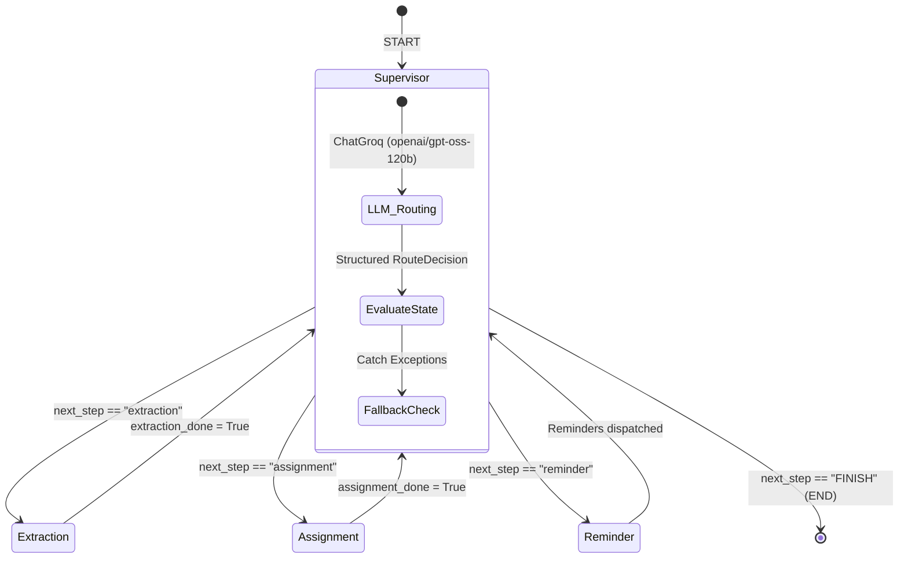
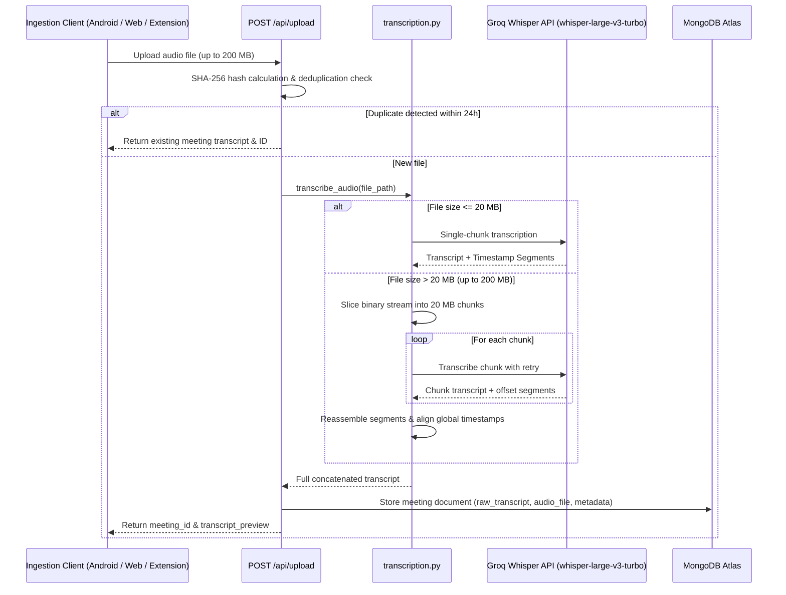
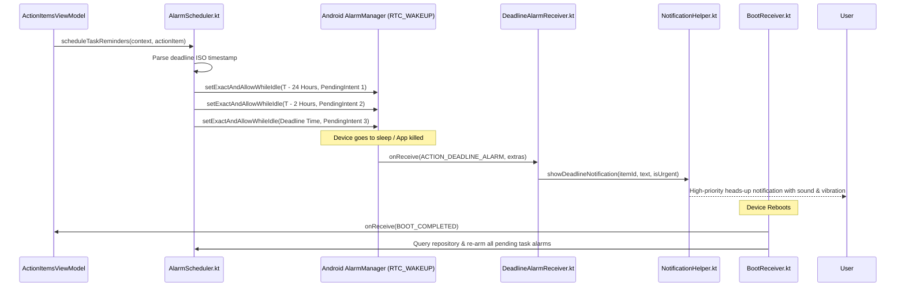
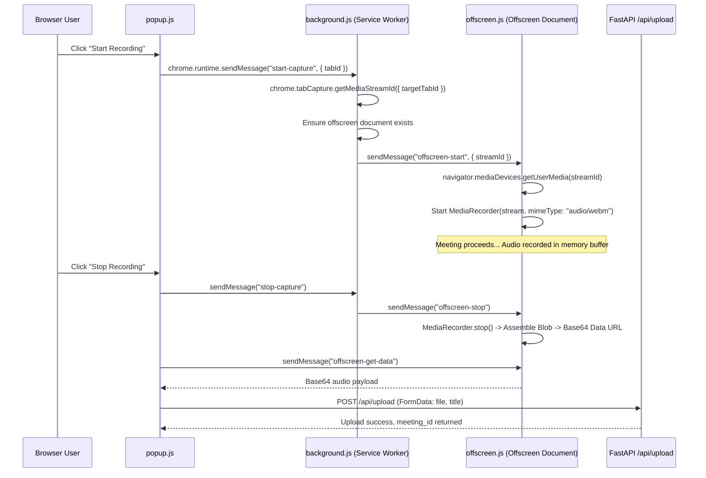

# 🏛️ System Architecture & Data Flow

This document details the architectural topology, data flow, component interactions, and state machines powering **Nudge AI**.

---

## 🌐 End-to-End System Topology

```mermaid
graph TD
    subgraph Ingestion ["1. Audio Ingestion & Capture Clients"]
        AndroidApp["📱 Android App\n(Kotlin AudioRecordingService)"]
        AndroidWidget["🔘 Home Screen AppWidget\n(1-Tap Toggle)"]
        ChromeExt["🧩 Chrome Extension MV3\n(tabCapture + Offscreen API)"]
        WebUpload["💻 React Web Dashboard\n(Drag & Drop Upload)"]
    end

    subgraph API_Gateway ["2. Backend Gateway (FastAPI on Render)"]
        RateLimiter["🛡️ Sliding-Window Rate Limiter\n(80 read/min, 15 heavy/min)"]
        UploadHandler["📥 Audio Upload & Deduplication\n(SHA-256 Hash Check)"]
        WhisperEngine["🎙️ Groq Whisper Engine\n(20MB Chunked Ingestion)"]
    end

    subgraph MultiAgentEngine ["3. LangGraph Multi-Agent Engine"]
        Supervisor["🧠 Supervisor Node\n(LLM Reasoning Router)"]
        Extractor["📝 Extraction Specialist\n(Decisions & Action Items)"]
        Assigner["👥 Assignment Specialist\n(Fuzzy Roster & Date Resolver)"]
        Summarizer["📄 Executive Summary Generator"]
    end

    subgraph Persistence ["4. Storage & Vector Search"]
        MongoDB[(🍃 MongoDB Atlas)\n• meetings\n• action_items\n• checkpoints]
        NomicVector["🔍 Atlas Vector Search\n(Nomic AI 768-dim Embeddings)"]
    end

    subgraph Automation ["5. Follow-Up & Reminder Engine"]
        Scheduler["⏰ APScheduler Background Loop\n(Runs every 30 mins)"]
        EmailService["📧 Gmail SMTP (HTML Templates)"]
        WhatsAppService["📱 WhatsApp Nudge Links"]
        SlackService["💬 Slack Block Kit Webhooks"]
        AndroidHardwareAlarms["🔔 Android Exact Alarms\n(AlarmManager RTC_WAKEUP)"]
    end

    AndroidWidget -->|Start/Stop Intent| AndroidApp
    AndroidApp -->|Stream M4A/WAV| RateLimiter
    ChromeExt -->|Send WebM Blob| RateLimiter
    WebUpload -->|Upload Audio/Video| RateLimiter

    RateLimiter --> UploadHandler
    UploadHandler --> WhisperEngine
    WhisperEngine -->|Transcript JSON| Supervisor

    Supervisor <-->|Route / Evaluate| Extractor
    Supervisor <-->|Route / Enrich| Assigner
    Supervisor -->|Generate Brief| Summarizer

    Extractor -->|Save Meetings & Tasks| MongoDB
    Assigner -->|Enrich Tasks| MongoDB
    Summarizer -->|Save Brief| MongoDB
    UploadHandler -->|Index Embeddings| NomicVector

    Scheduler -->|Poll Due Tasks| MongoDB
    Scheduler -->|Dispatch Escalation| EmailService
    Scheduler -->|Generate Action Links| WhatsAppService
    Scheduler -->|Post Alerts| SlackService

    MongoDB -->|Sync Tasks| AndroidApp
    AndroidApp -->|Arm Hardware Alarms| AndroidHardwareAlarms
```

---

## 🤖 LangGraph Multi-Agent Engine

The core intelligence layer is implemented in [backend/agents/graph.py](file:///c:/Users/suren/Nudge/backend/agents/graph.py) using **LangGraph** (`StateGraph`) with state checkpointing via `MongoDBSaver`.

### State Machine Definition

The shared state flowing through all graph nodes is defined in [backend/agents/state.py](file:///c:/Users/suren/Nudge/backend/agents/state.py):

```python
class MeetingAgentState(TypedDict, total=False):
    messages: Annotated[list, add_messages]  # Accumulates LLM reasoning chain
    meeting_id: str                          # MongoDB ObjectId string
    raw_transcript: str                      # Full speech-to-text output
    decisions: list[str]                     # Extracted team decisions
    action_items: list[dict]                 # List of structured action items
    needs_human_review: bool                 # True if any confidence score < 0.7
    current_action: str                      # "process_meeting" | "check_and_remind"
    next_step: str                           # Next specialist ("extraction", "assignment", "reminder", "FINISH")
    extraction_done: bool                    # Loop prevention guard
    assignment_done: bool                    # Loop prevention guard
    self_name: str | None                    # Recorder's name for `is_mine` attribution
```

### Graph Topology & Routing Cycle



### Specialist Agent Responsibilities

1. **Supervisor Node** ([backend/agents/supervisor.py](file:///c:/Users/suren/Nudge/backend/agents/supervisor.py)):
   - Evaluates the current state using `ChatGroq` structured output (`RouteDecision`).
   - If `current_action == "process_meeting"` and `extraction_done == False`, routes to `extraction`.
   - If `extraction_done == True` and action items exist and `assignment_done == False`, routes to `assignment`.
   - Once all operations complete, routes to `FINISH` (`END`).
   - Contains a deterministic fallback (`_deterministic_route`) to guarantee pipeline execution even if the LLM invocation fails.

2. **Extraction Specialist** ([backend/agents/extraction.py](file:///c:/Users/suren/Nudge/backend/agents/extraction.py)):
   - Parses the meeting transcript using `ChatGroq` with `ExtractionResult` Pydantic model.
   - Extracts explicit decisions and actionable tasks.
   - Assigns confidence scores ($0.0 \dots 1.0$). If any confidence is $< 0.7$, flags `needs_human_review = True`.
   - Tags `is_mine = True` if the owner name matches or sounds like `self_name` (or if unassigned / no `self_name` provided).

3. **Assignment Specialist** ([backend/agents/assignment.py](file:///c:/Users/suren/Nudge/backend/agents/assignment.py)):
   - Uses `difflib.SequenceMatcher` to fuzzy-match spoken names against the team roster (`DEFAULT_ROSTER`).
   - Resolves relative deadline strings (*"by Friday"*, *"next Tuesday 5pm"*, *"by end of week"*) to normalized ISO date strings (`YYYY-MM-DD`) via [backend/utils/date_parser.py](file:///c:/Users/suren/Nudge/backend/utils/date_parser.py).

4. **Reminder Specialist** ([backend/agents/reminder.py](file:///c:/Users/suren/Nudge/backend/agents/reminder.py)):
   - Checks action items for approaching or overdue deadlines ($< 24$ hours).
   - Increments `reminder_count` and triggers escalating follow-ups:
     - **Count 1**: Friendly email & Slack notification.
     - **Count 2**: Firm follow-up email & warning Slack alert.
     - **Count 3+**: Automatic escalation (status set to `escalated`, CC to manager).

---

## 🎙️ Audio Ingestion & Chunking Pipeline

Groq Whisper API enforces a strict **25 MB per-request file limit**. Real-world meetings (1–2 hours) easily produce 50–200 MB files.

[backend/services/transcription.py](file:///c:/Users/suren/Nudge/backend/services/transcription.py) implements a pure-Python streaming chunker:



---

## 🔔 Native Android Hardware Alarm Subsystem

To guarantee reliable deadline alerts when the Android app is closed or the device enters deep sleep (Doze mode), the app bypasses unreliable polling mechanisms and uses **hardware-level exact alarms**.



---

## 🧩 Chrome Extension Manifest V3 Architecture

In Chrome Manifest V3, background service workers **cannot access Web Audio APIs or `MediaRecorder` directly**.

[extension/background.js](file:///c:/Users/suren/Nudge/extension/background.js) delegates recording to a dedicated `offscreen.html` context:



---

## 🔍 Semantic Search & RAG Architecture

[backend/services/rag_service.py](file:///c:/Users/suren/Nudge/backend/services/rag_service.py) enables cross-meeting semantic search using cloud embeddings and MongoDB Atlas Vector Search:

1. **Embedding Generation**: Uses `nomic-embed-text-v1.5` to generate 768-dimensional vectors. Task prefixes (`search_document: ` for indexing, `search_query: ` for user search) are automatically prepended.
2. **Indexing**: Meeting titles, decisions, and transcript previews are indexed in the `meeting_embeddings` MongoDB collection upon processing.
3. **Vector Query**: Searches use the MongoDB `$vectorSearch` aggregation stage with cosine similarity (`INDEX_NAME = "nudge_meeting_vector_index"`).
4. **Fallback**: If vector search is not yet provisioned in Atlas, queries gracefully fall back to full-text search (`$text` index on `action_items`).

---

## 🔗 Related Notes
- [[Home|Home Overview]]
- [[Modules/Backend|Backend Module Details]]
- [[Modules/Agents|Agents Module & Prompts]]
- [[Modules/Android|Android Native Implementation]]
- [[Modules/Extension|Chrome Extension Details]]
- [[Decisions|Architectural Decisions & ADRs]]
